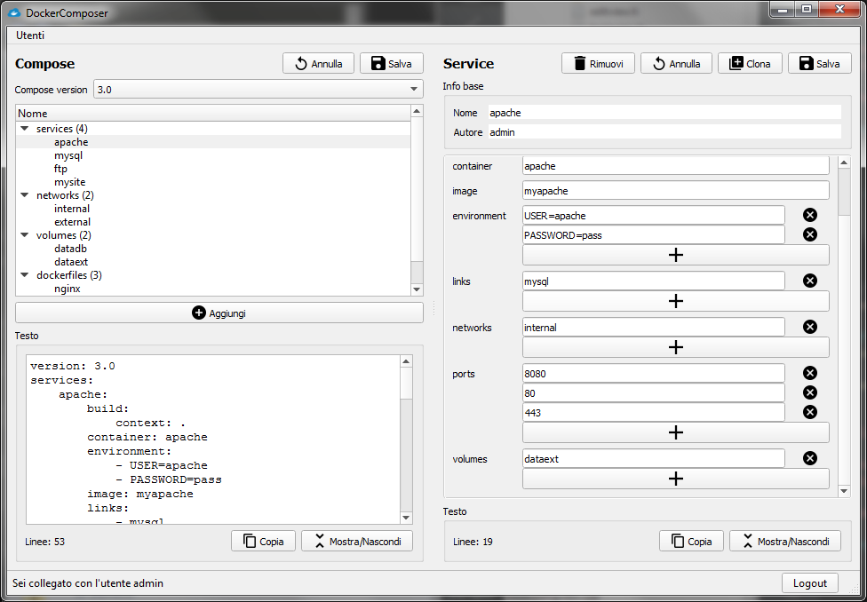

# Progetto Programmazione ad Oggetti (P2) - "DockerComposer"



Il progetto è stato sviluppato nell'arco di un mese, a scopo didattico, per il corso di Programmazione ad Oggeti dell'anno 2016/2017 all'Università di Padova.

Valutazione del progetto: Eccellente.

### Scopo del progetto

Il progetto DockerComposer vuole fornire una interfaccia utente per la creazione, lettura e modifica di file `docker-compose.yml` (o "compose"), un file di configurazione usato da Compose, un tool di Docker.

Docker è un progetto open-source che automatizza il processo di deployment di applicazioni (o "service") all'interno di container software, gestendo autonomamente le risorse in un ambiente incapsulato. 
Compose (Docker Compose) è un tool che si occupa di definire l'interazione fra i componenti e le risorse di docker (o "parti del compose") in un'unica configurazione, semplificandone l'utilizzo. È dunque essenziale per uno sviluppo più veloce in ambiente di testing automatizzati o di sviluppo di software (per isolarlo e limitare le risorse).

È possibile connettere un service con altre parti dello stesso compose. Ogni parte appartiene ad una delle seguenti categorie: Service, Network o Volume (descritte più in dettaglio successivamente).  
Solitamente i file compose vengono modificati manualmente via un editor di testo.
Le funzioni aggiunte dall'applicazione rispetto ad un editor di testo sono: i suggerimenti dell'autocompletamento per il riferimento di altri parti all'interno del compose, la generazione di un file YAML valido, feedback visivi di alcuni problemi comuni, la gestione di utenti con diversi permessi per collaborare sullo stesso compose, l'esportazione di singole parti e l'unicità dei nomi delle parti.
La finalità dell'applicazione è quella di produrre un output di testo della configurazione compose valida.

La gestione degli utenti è delegata dall'utente "admin" (sempre presente di default), il quale è l'unico a poter creare/rimuovere altri utenti ed assegnare loro un ruolo, e i relativi permessi.  
Gli utenti sono suddivisi in base ai permessi, in 5 classi, Admin, Manager, Complete, Network e Volume, in base a quali parti possono modificare e se solamente le proprie o anche create da altri utenti.

#### Vincoli di progetto

Il progetto consiste in un modulo di amministrazione ed in un modulo utente. I vincoli obbligatori sono i seguenti:

1. Il modulo di amministrazione deve permettere:
	1. Lettura da file a memoria e scrittura da memoria su file del contenitore C. Non vi sono vincoli sulla tipologia del contenitore C e sul formato di memorizzazione di C su file.
	2. Inserimenti, rimozioni e modifiche degli oggetti di C in memoria. Non vi sono vincoli sulla natura degli oggetti memorizzati, possibilmente anche di diversa natura.
	3. Gestione degli utenti del sistema: registrazione, rimozione e modifiche di utenti.
	4. Si devono prevedere più tipi di registrazione per gli utenti, in cui ogni tipo di registrazione garantisce all’utente diversi servizi di accesso al contenitore C, ad esempio fornisce diverse capacità di interrogazione e ricerca.
2. Il modulo utente deve permettere ad un utente registrato U di accedere al contenitore C secondo i servizi di accesso garantiti ad U dal suo tipo di registrazione.
3. Sia il modulo di amministrazione che il modulo utente devono essere dotati di una GUI sviluppata nel framework Qt.

### Altre risorse

- [Relazione](relazione.pdf)
- [Dati di esempio](data/)
- [Libreria JSON nlohmann/json](https://github.com/nlohmann/json)

Relazione generata con `pandoc`:

```
cd docs/
pandoc -f markdown+footnotes -t latex -o relazione.pdf --latex-engine=xelatex -s relazione.md
```